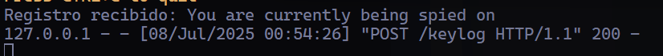

# 🎯 Python Keylogger — Cybersecurity Educational Project

This project is part of my personal journey after completing a 100-hour Python course from SEPE.  
It reflects some of the core knowledge I gained during the course and marks my first step into the field of **cybersecurity**.

The goal of this project is to explore how a simple keylogger works, how it can be built with Python, and more importantly — how to detect and protect against such threats.

⚠️ **This project is for educational purposes only. All tests were performed in a safe, local environment.**

---

## 🚀 Features

- ✅ Keylogger built with Python and the `keyboard` module  
- ✅ Captures typed words and sends them to a Flask server  
- ✅ Handles special keys like space, enter, tab, and backspace  
- ✅ Supports `.exe` generation with a custom icon using PyInstaller  
- ✅ Created for cybersecurity research and self-defense education  

---

## 🛠 Technologies Used

- Python 3.10+
- [`keyboard`](https://pypi.org/project/keyboard/) — for capturing keystrokes  
- [`requests`](https://pypi.org/project/requests/) — for HTTP requests  
- [`flask`](https://pypi.org/project/flask/) — backend server  
- `threading` — for sending logs at regular intervals (optional)  
- [`PyInstaller`](https://www.pyinstaller.org/) — to compile the script into an `.exe`  

---

## 📦 Installation

1. **Clone the repository**
   ```bash
   git clone https://github.com/oOmyLoveOo/Python-keylogger.git
   cd Python-keylogger


2. **Install dependecies**
    ```bash
    pip install -r requirements.txt

3. (optional) ** Create virtual environment**
    ```bash
    python -m venv venv
    source venv/bin/activate 
--- 

## 🧪 How to run it

1. **Start the Flask server**
    ```bash
    cd server
    python server.py

2. **Run the Keylogger(client)**
    ```bash
    cd client
    python pokemon.py

- The script listens for keystrokes.
- When Enter is pressed, it sends all captured words to the server as a POST request.
- Words are separated by spaces or new lines.
- Clears the log after sending

## In case you want to make it more realistic
To convert the script into a Windows executable with a custom icon:
    ```bash
    pyinstaller --onefile --noconsole --icon=pokeball.ico pokemon.py

## 🛑 How to stop the keylogger
To stop the keylogger when it's executed in .exe, just find the proccess or pid and kill it

## 💡 Defensive Takeaways
By creating this keylogger, I also learned:

-How malicious software can operate silently
-The importance of monitoring background processes
-How to detect unexpected network activity or hooks on input devices
-Basic awareness of red flags in executable behavior

## 🙌 Final Thoughts
This was a fun and educational project to solidify my Python skills and gain insight into the world of cybersecurity.
If you're also exploring this field, feel free to fork, explore, and learn from it.

→ Learning how things work is the first step to defending against them.

## 🖼️ Screenshots

### 🧪 Client Running (Keylogger)


### 🛡️ Flask Server Receiving Logs


### 🧾 Keystroke Input
